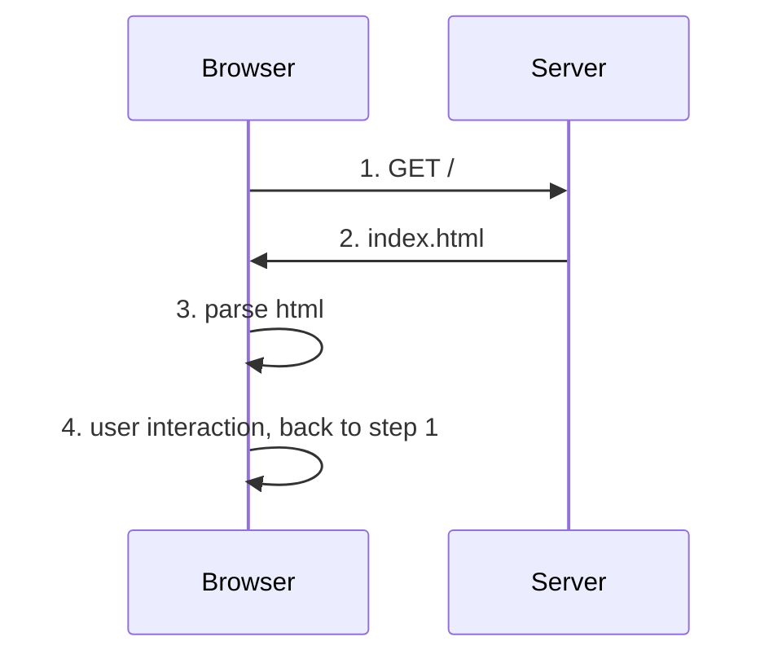
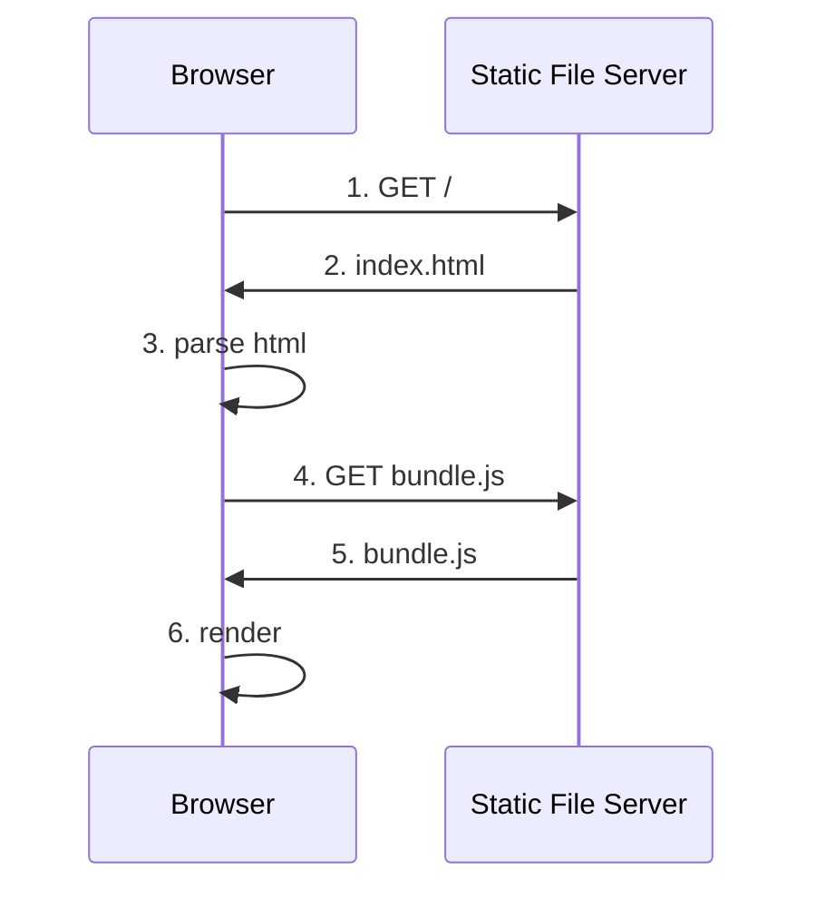
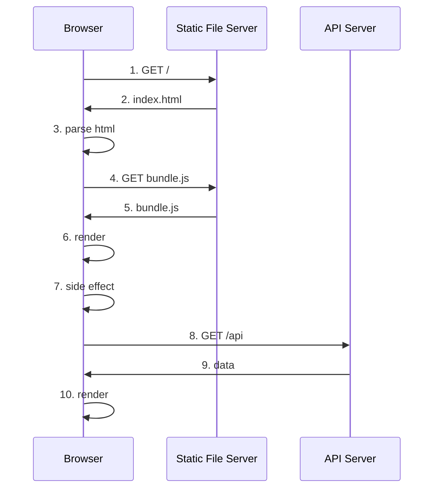
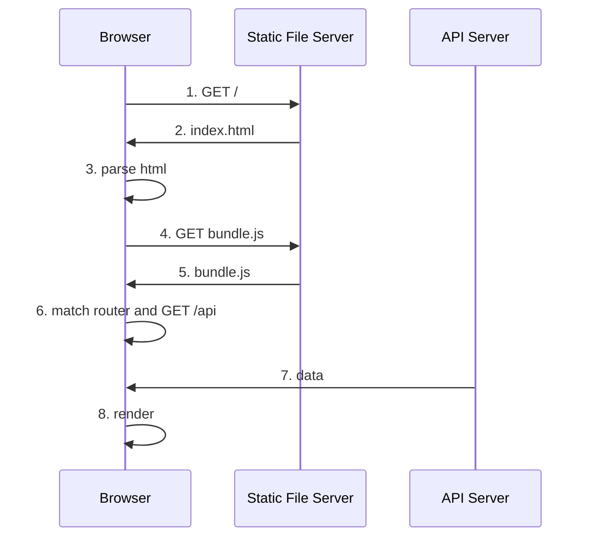
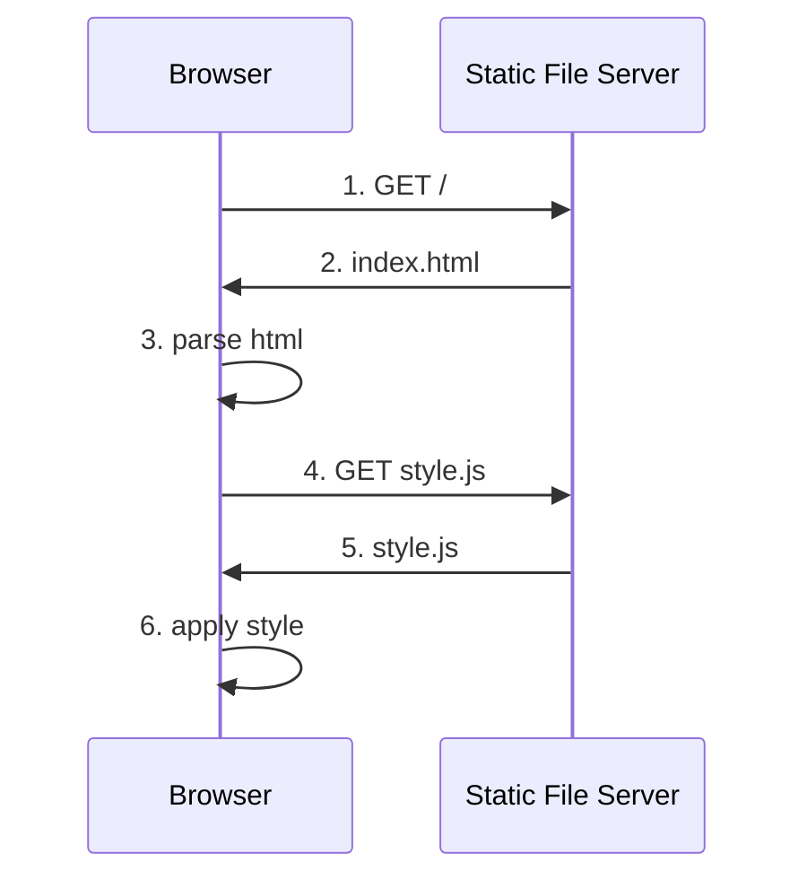
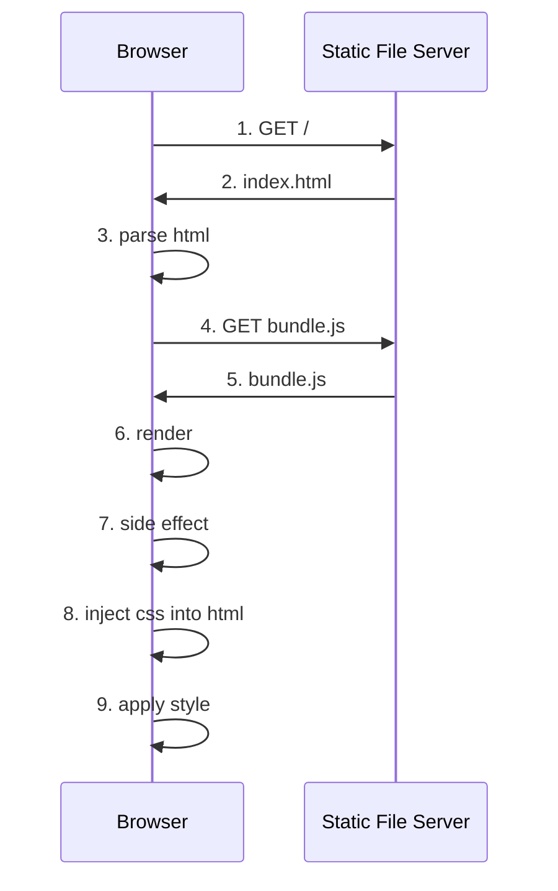
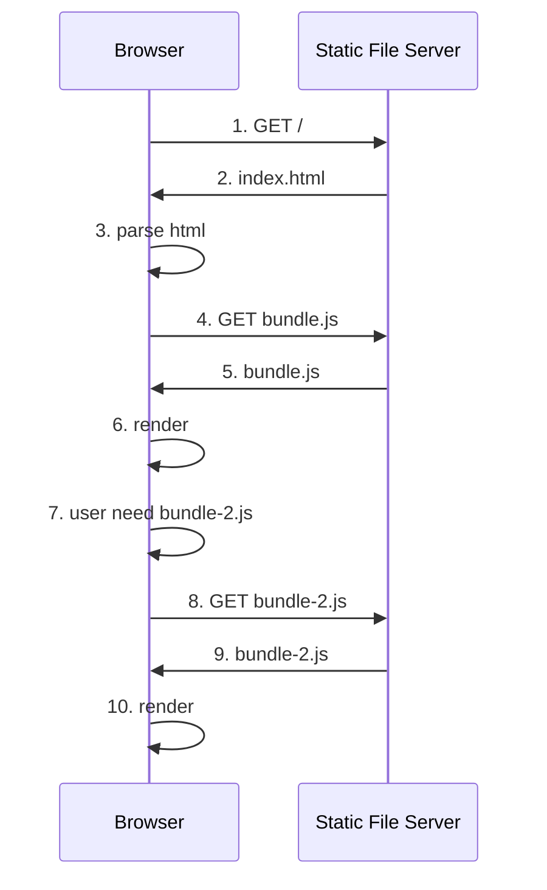

---
meta:
  - title: client side render 的 request response model
  - name: description
    content:
  - name: keywords
    content: frontend, react, client side render, request response model
  - name: og:image
    content: https://images.unsplash.com/photo-1683009427051-00a2fe827a2c

published: 2024-01-19
---

# {frontmatter.meta[0].title}


這篇文章
我想應該適用於任何一個階段的工程師或是架構師或是主管。

為了解釋 client side render 的運作方式，
我想透過 request response model 來梳理抽象流程 (類似演算法)，
來去掉實際的硬體或是網路的差異 (類似Big O)。

以下流程不會因為 http 版本的不同而有所差異。

在這邊不討論實際部署方式，有時間以後再討論。

無論是 [useEffect][use_effect] 或 [componentDidMount][component_did_mount]，以下統稱為 [side effect][side_effect]。

[use_effect]: https://react.dev/reference/react/useEffect
[component_did_mount]: https://react.dev/reference/react/Component#componentdidmount
[side_effect]: https://en.wikipedia.org/wiki/Side_effect_(computer_science)#:~:text=In%20computer%20science%2C%20an%20operation,the%20invoker%20of%20the%20operation.

注意在架構的世界沒有絕對的好壞，
各種方案都有各自的優缺點，也有對應的優化方案，
每段的前半段會盡量客觀解釋各方案的系統流程，
後半才會提出一些個人的主觀觀點。

## traditional server render 架構

> 為了方便區分，
  以下用詞會用 traditional server render 與 modern server render。

為了提供對照組，這邊先介紹傳統的 server client 架構，
包含 [php]、[jsp]、[asp]、[blazor]、[rails]、[django] 等等，
都是在 Server 端產生 html，再回傳給 Client 端。

[php]: https://www.php.net/
[jsp]: https://docs.oracle.com/javaee/5/tutorial/doc/bnagy.html#bnagz
[asp]: https://learn.microsoft.com/en-us/aspnet/core/getting-started/?view=aspnetcore-8.0&tabs=macos
[blazor]: https://learn.microsoft.com/en-us/aspnet/core/blazor/?view=aspnetcore-8.0
[rails]: https://guides.rubyonrails.org/layouts_and_rendering.html
[django]: https://docs.djangoproject.com/en/5.0/ref/templates/language/



1. Browser 對 Server 發出第一次 GET 請求，
   該請求可以由網址輸入、超連結、表單提交等方式發起。

2. Server 接收到請求後，根據請求在 Server 端動態生成 html，並回傳 html 給 Browser。

3. Browser 接收到 html 後，開始解析 html。

4. 用戶與畫面互動，例如：點擊超連結、表單提交等等，
   會再次發出請求，回到第一步。

### 觀點

在 WEB 發展的前中期，這種架構是主流，
這種架構的好處是幾乎所有的邏輯都是由 Server 端處理，
Client 端只需要處理非常簡單的 UI 邏輯，
即便後來發展了 [AJAX][ajax]，也並沒有改變 Server 需要負責大部分邏輯的情況。

[ajax]: https://en.wikipedia.org/wiki/Ajax_(programming)

這個架構在互動性上有很大的缺陷，
因為大多數用戶操作都需要仰賴網路請求，
重新生成 html，再回傳給 Client 端，Browser 重新解析 html。

如果當前專案大量仰賴 database 的資料，或是表單提交，
用戶對於操作的回饋不需要太即時，
那麼使用傳統的 server render 架構是蠻合理的選擇。

例如：
後台管理系統 (航班管理、訂單管理、商品管理等等)。

## Single Page Application (SPA)

[Single Page Application][spa] 概念是，
在一開始時就載入呈現面的相關資源，
讓接下來有關畫面呈現的邏輯 (例如：換頁) 直接能在 Client 端自行完成 (透過 javascript)，
而不需要一直向 server 端請求頁面。

接下來要提到的 client side render、modern server side render 等等，
都屬於 Single Page Application 的範疇。

[spa]: https://en.wikipedia.org/wiki/Single-page_application

## client side render

在純 client side render 的 react 應用程式，
我們會將 react build 後產生的檔案放在一個靜態檔案伺服器上，
靜態檔案伺服器可以是 [nginx]、[apache]、[github pages][gh_page] 等等。

[nginx]: https://www.nginx.com/
[apache]: https://www.apache.org/
[gh_page]: https://pages.github.com/



1. Browser 對 Server 發出第一次 GET 請求，
   該請求可以由網址輸入、超連結、表單提交等方式發起。

2. Server 接收到請求後，回傳 index.html 給 Browser。

3. Browser 接收到 index.html 後，開始解析 html。
   假設 index.html 如下：

   ```html
   <html>
     <head>
        <link rel="stylesheet" href="style.css">
     </head>
     <body>
       <div id="root"></div>
       <script src="bundle.js"></script>
     </body>
   </html>
   ```

4. 發出相關資源請求，請求包括 index.html 中引用的 css、js、圖片等資源。
   以 3 為例，Browser 會對 server 發出 GET bundle.js 的請求。

5. Server 回傳 bundle.js 給 Browser。

6. Browser 執行 bundle.js，執行第一次 react render 流程。

以上為最簡單的第一次 react render 的過程，
注意到從 1 到 5 的過程中，用戶是看不到任何有意義畫面的，
一直到第 6 步驟，才會看到第一次 render 的畫面。

### 觀點

由於畫面呈現面 (Presentation) 可以完全在 Client 端完成，
它可以省下不必要的網路請求，與 Server 端的計算資源，
當畫面呈現面的邏輯複雜度遠大於其他邏輯時，
例如：網頁遊戲、網頁繪圖、網頁影音編輯等等，
這時候使用 client side render 是蠻合理的選擇。

> 官方網站、形象網站等需要 SEO 的網站，
  比起 client side render，建議使用 modern server side render。

## client side render 與 動態資料

假如應用程式仰賴動態資料，例如從 Server 端取得的資料，
還需要額外的一些步驟。



前六點相同，以下為新增的步驟：

7. react render 流程結束，執行 side effect

8. 若 side effect 包含非同步請求，則會在此時發出請求。

9. Server 接收到請求後，回傳資料給 Browser。

10. Browser 接收到資料後，更新 state，執行第二次 react render 流程。

站在用戶角度而言，直到第 10 步才算能接收到想獲取的資訊。

### 觀點

這種架構的好處是，可以將畫面呈現面的邏輯完全交給 Client 端，
Server 端只需要負責資料的處理，並回傳純資料給 Client 端。

以前異步請求被稱作 [AJAX][ajax]，
如今幾乎沒有人特別提這個詞，
因為在 client side render 架構下，異步請求是理所當然的事情。

這個作法也有它的問題，
首先它發出請求資料的時間點在第 7 步驟，
也就是說，用戶在第 6 步驟看到的畫面，
會因為第 7 步驟的請求而改變，
這個改變的過程如果沒有妥善處理會給用戶一瞬間的不適感，
如何降低這種不適感，是一個需要思考的問題。

## client side render 與 動態資料 (client loader)

在 react router v6 之後，他們試圖導入了 [client loader][loader] 的概念，
這種架構是為了試圖解決上一個架構的問題而提出的，

[loader]: https://reactrouter.com/en/main/route/loader



前五點相同，以下為新增的步驟：

6. 根據當前網址，如果對應到依賴資料的路徑就發出相關請求。

7. Server 接收到請求後，回傳資料給 Browser。

8. Browser 接收到資料後，在執行 render 流程。

### 觀點

這提供 Client 端另一個解決方案，
render 會等到 loader 完成後才會執行，
讓第一次 render 時就能夠獲取到資料。

延遲 render 等於是用戶等待畫面出現的時間變長，
所以如何妥善使用是一個需要思考的問題。

## client side render 與 static css (compile time css)

此類型包含任何一種在 compile 後就固定不會在變動的 css 方案，
例如 css、css module、sass、tailwindcss、stylex 等等。



前三點相同，以下為新增的步驟：

4. 發出相關資源請求，請求包括 index.html 中引用的 css、js、圖片等資源。
   以 3 為例，Browser 會對 server 發出 GET style.js 的請求。

5. Server 回傳 style.css 給 Browser。

6. Browser 套用 style.css。

### 觀點

這種架構遵循最單純方式，
無論到底撰寫時是用哪種 css 方案，
最後都會被編譯成單純的 css 檔案。

因為最終結果從 request response model 來看差異不大，
所以各種 css 方案的優缺點，可能需要從其他角度來思考。

## client side render 與 runtime css-in-js

此類型包含任何一種在 runtime 時才會產生 css 的方案，
例如 styled-component、emotion 等等。



前六點相同，以下為新增的步驟：

7. react render 流程結束，執行 side effect。

8. side effect 會解析需要產生的 css，並將 css 注入到 html 中。

9. Browser 套用 css。

### 觀點

曾經 css-in-js 在 react 生態圈一度成為主流，
我也認同應該要盡量將 style 與其對應的 component 放在一起會比較容易維護，
但早期實作付出的代價就是 runtime 產生 css 的成本，
它需要在 runtime 解析生成 css，並注入到 html 中，
而這兩項成本都是不小的。

如今我會建議使用 compile time css 方案，
因為它可以在 compile 時就產生 css，
並且不需要在 runtime 時解析 css，
這樣可以減少 bundle size，也可以減少 runtime 的執行成本。

## client side render 與 lazy load

lazy load 的概念是，只有在需要時才會載入資源，
例如 react 的 lazy、loadable component 等等。

主要用途是為了減少 initial render 時需要載入的資源量。



前六點相同，以下為新增的步驟：

7. 用戶需要 bundle-2.js，例如：scroll 到特定位置、點擊超連結、表單提交等等。

8. Browser 發出 GET bundle-2.js 的請求。

9. Server 回傳 bundle-2.js 給 Browser。

10. Browser 執行 bundle-2.js，執行第二次 react render 流程。

### 觀點

這個架構嘗試解決 client side render 第一次 render 時需要載入大量資源的問題，
它算是 junior frontend engineer 可以自己嘗試的優化方案，
透過區分哪些資源是初次 render 時必要的，而哪些資源是非必要的。

而這個方案的成本是需要額外的一次請求，
如果請求的資源量不大，那麼這個成本是可以接受的。

但也因為 junior 不一定會去思考 lazy load 背後的機制與原因，
如果沒有在正確的場景使用，反而不會解決效能問題還會變得更慢。

像是明明是在第一次 render 時就需要立刻顯示的資源，
卻因為 lazy load 的關係，
導致用戶需要等待第二次 render 才能看到想要的畫面，
這樣的情況就是不正確的使用 lazy load。

## 結語

client side render 的優點是可以將畫面呈現面的邏輯完全交給 Client 端，
Server 端只需要負責資料的處理，並回傳純資料給 Client 端。

通常 junior 階段的前端工程師會最先接觸到架構就是 client side render，
因為它的概念簡單，也不需要太多網路相關知識，
它的相關優化方案即便在之後介紹到 modern server side render 都還是有用的。

當然，client side render 的優點也是它的缺點，
就是只需要撰寫與思考 Browser 端，
這樣做的壞處就是 WEB 應用有些方案是需要 Server 端的配合，
而在純粹 client side render 的架構下，Server 端的方案就無法使用。

所以前端隨著時間發展，也會開始思考 Server 端的方案，
例如：modern server side render、ssg、ssr、isr 等等，
這些方案都是為了解決 client side render 的缺點而提出的。

因為前端也可能會有自己的 Server，
建議讀者不應該透過 Server 端 與 Browser 端來區分前後端工程師，
而是透過該工程師的關注點來區分。
