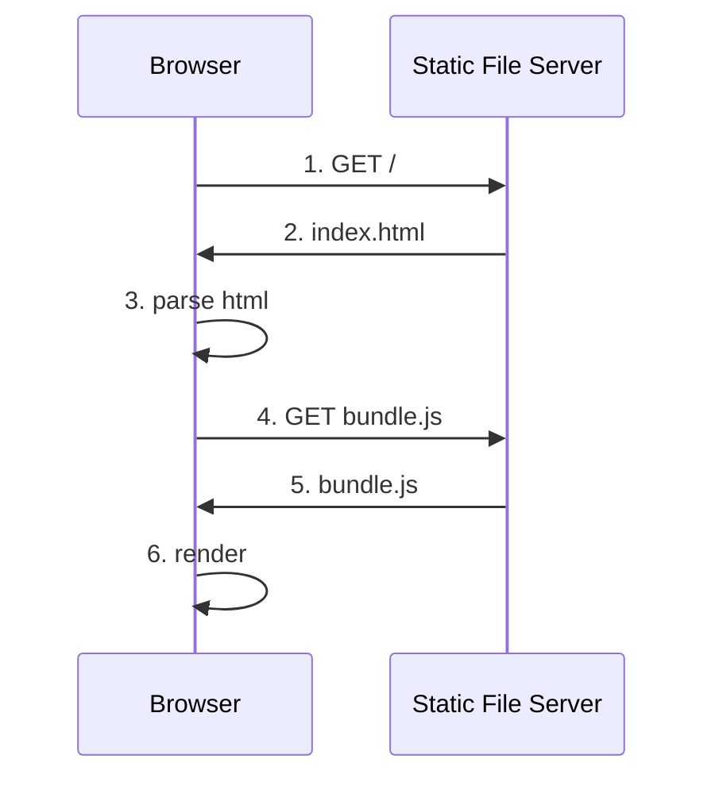
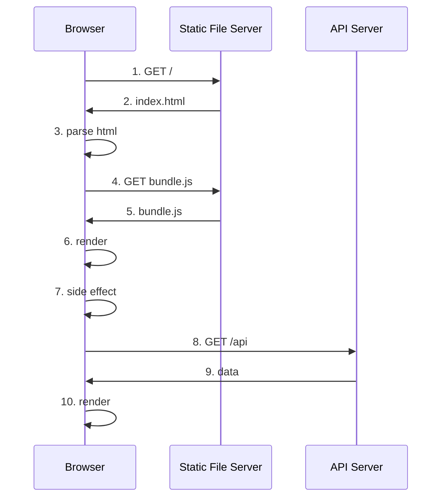
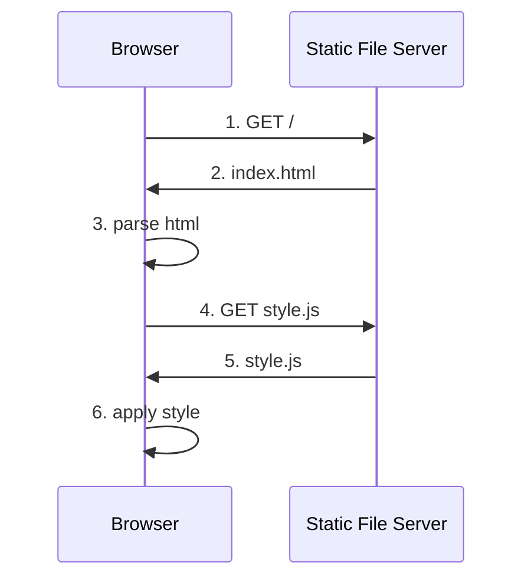
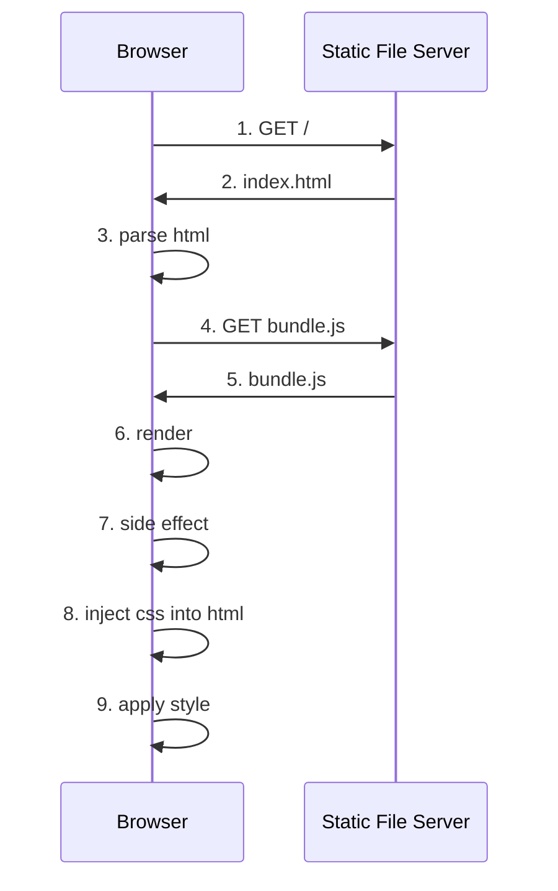
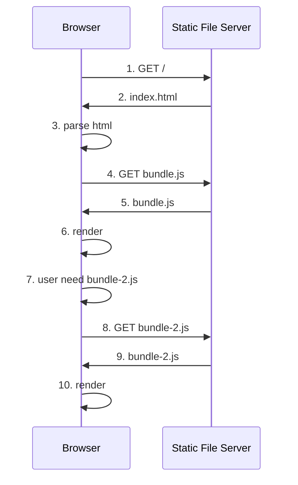

在這邊不討論靜態檔案伺服器的部署方式，有時間以後再討論。

無論是 `useEffect` 或 `componentDidMount`，以下統稱為 side effect。

流程不會因為 http 版本的不同而有所差異。

各種方案都有各自的優缺點，也有對應的優化方案，
前半段會盡量客觀分析個方案的系統流程，
最後才會提出一些個人的主觀看法。

## client side render 與 initial render

在純 client side render 的 react 應用程式，
我們會將 react build 後產生的檔案放在一個靜態檔案伺服器上，
靜態檔案伺服器可以是 nginx、apache、github pages 等等。



1. Browser 對 Server 發出第一次 GET 請求，
   該請求可以由網址輸入、超連結、表單提交等方式發起。

2. Server 接收到請求後，回傳 index.html 給 Browser。

3. Browser 接收到 index.html 後，開始解析 html。
   假設 index.html 如下：

   ```html
   <html>
     <head>
        <link rel="stylesheet" href="style.css">
     </head>
     <body>
       <div id="root"></div>
       <script src="bundle.js"></script>
     </body>
   </html>
   ```

4. 發出相關資源請求，請求包括 index.html 中引用的 css、js、圖片等資源。
   以 3 為例，Browser 會對 server 發出 GET bundle.js 的請求。

5. Server 回傳 bundle.js 給 Browser。

6. Browser 執行 bundle.js，執行第一次 react render 流程。

以上為最簡單的第一次 react render 的過程，
注意到從 1 到 5 的過程中，用戶是看不到任何有意義畫面的，
一直到第 6 步驟，才會看到第一次 render 的畫面。

## client side render 與 動態資料

假如應用程式仰賴動態資料，例如從 server 端取得的資料，
還需要額外的一些步驟。



前六點相同，以下為新增的步驟：

7. react render 流程結束，執行 side effect

8. 若 side effect 包含非同步請求，則會在此時發出請求。

9. Server 接收到請求後，回傳資料給 Browser。

10. Browser 接收到資料後，更新 state，執行第二次 react render 流程。

站在用戶角度而言，直到第 10 步才算能接收到想獲取的資訊。

## client side render 與 static css

此類型包含任何一種在 compile 後就固定不會在變動的 css 方案，
例如 css、css module、sass、tailwindcss、stylex 等等。



前三點相同，以下為新增的步驟：

4. 發出相關資源請求，請求包括 index.html 中引用的 css、js、圖片等資源。
   以 3 為例，Browser 會對 server 發出 GET style.js 的請求。

5. Server 回傳 style.css 給 Browser。

6. Browser 套用 style.css。

## client side render 與 runtime css

此類型包含任何一種在 runtime 時才會產生 css 的方案，
例如 styled-component、emotion 等等。



前六點相同，以下為新增的步驟：

7. react render 流程結束，執行 side effect。

8. side effect 會解析需要產生的 css，並將 css 注入到 html 中。

9. Browser 套用 css。

## client side render 與 lazy load

lazy load 的概念是，只有在需要時才會載入資源，
例如 react 的 lazy、loadable component 等等。

主要用途是為了減少 initial render 時需要載入的資源量。



前六點相同，以下為新增的步驟：

7. 用戶需要 bundle-2.js，例如：scroll 到特定位置、點擊超連結、表單提交等等。

8. Browser 發出 GET bundle-2.js 的請求。

9. Server 回傳 bundle-2.js 給 Browser。

10. Browser 執行 bundle-2.js，執行第二次 react render 流程。


## client side render 的好處
